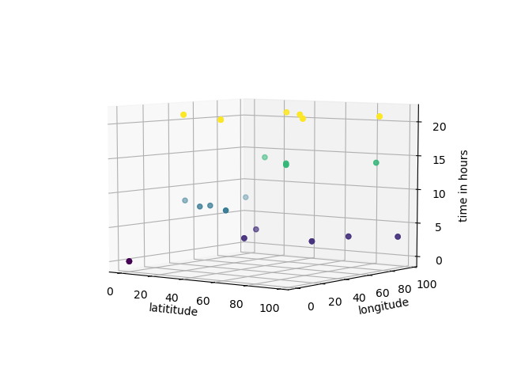
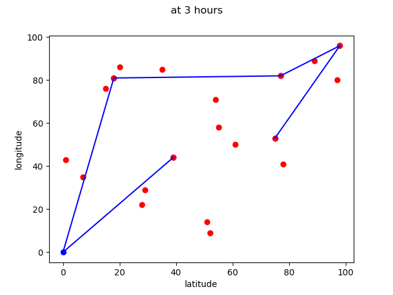
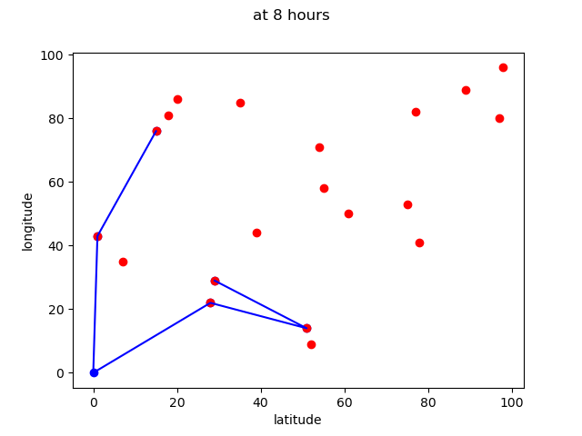
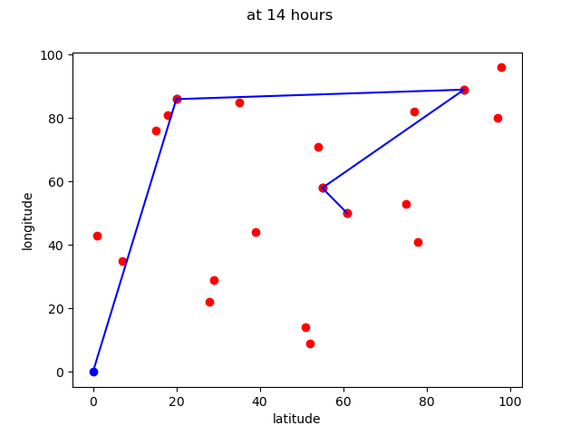
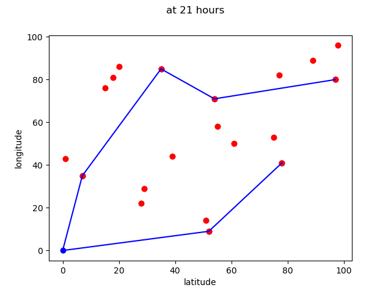

# Time optimization of garbage collection

# Abstract
Garbage collection continues to be a large problem in towns and metropolitan areas. We intend to utilize the Internet of Things to come up with a solution to this problem. We are proposing a method to collect garbage at the most optimum times of the day so as to make sure excess garbage is not left in the open any longer than necessary or dumped in the streets instead. 

 

# Proposed technique
The current method we intend to use is as follows:- 
1.	Use a smart dustbin to send garbage level to the cloud. 
2.	Do a time analysis of the data. 
3.	Apply a K Means classifier to group data in to N distinct temporal groups where N is the number of trips a truck can make in a day. 
4.	Accordingly, schedule timings when garbage truck should collect garbage and locations where they will be collected from. 

# File descriptions

**doctored_2_visual_only.csv** - contains information of position of garbage bins, serial number and when they got filled in a day. 
**doctored_2.csv** - Same as previous except, it is used in code. 
**clustering.py** - provides a K means temporal clustering to cluster data in the **doctored_2.csv**. The number of clusters correspond to number of trips a truck can make in a day. 
**path optimization.py** - Plots cluster paths accoding to output from **clustering.py** . ( **Please note:-** (0,0) is assumed to be location of the main landfill/dump .) 

# Results

# a) 3d plot of x,y vs time
 

# b) Temporal clustered results are as follows ( 4 truck trips were requested in this case )
 
 
 
 
